# Nimbus Signal Flow

This document details the audio and MIDI signal flow within the Nimbus audio engine. Understanding how data moves through the processing graph is essential for maintaining predictable latency, proper delay compensation, and accurate phase alignment.

## 1. Global Audio Signal Flow

The audio signal flow is driven entirely by the hardware callback (e.g., ASIO `bufferSwitch`). When the hardware requests a buffer of audio, the Audio Engine traverses the processing graph to produce the exact number of samples requested.

### 1.1 The Processing Graph Pipeline

1.  **Hardware Input:** Data is read from the physical inputs of the audio interface.
2.  **Input Routing:** Physical inputs are mapped to logical input buses within the DAW.
3.  **Track Processing (Audio Tracks):**
    *   **Input Monitoring:** If enabled, route live input into the track.
    *   **Disk Streaming:** Read audio clips from the timeline (processed ahead of time by worker threads).
    *   **Clip Effects:** Apply offline clip-based DSP or fades.
    *   **Insert FX:** Pass the audio through the chain of VST3 plugins or internal DSP nodes on the track.
    *   **Pre-Fader Sends:** Tap the audio signal before the track volume fader and send it to Return/Aux tracks.
    *   **Track Fader & Panning:** Apply the volume envelope/fader value and pan the signal according to the selected panning law (e.g., -3dB center).
    *   **Post-Fader Sends:** Tap the audio signal after the track fader.
4.  **Group/Bus Processing:** Track outputs are summed into subgroups, which have their own Insert FX and Faders.
5.  **Master Bus Processing:** All subgroups and un-grouped tracks are summed into the Master Bus. Master effects (e.g., Limiter, Master EQ) are applied.
6.  **Hardware Output Routing:** The Master Bus output (and any direct track outputs) are mapped to logical output buses.
7.  **Hardware Output:** The final float buffers are converted to the hardware bit-depth and handed back to the OS/Audio Driver.

### 1.2 Audio Flow Diagram

```mermaid
graph TD
    %% Hardware Inputs
    HW_IN[Hardware Audio Input] --> Input_Bus[Logical Input Bus]
    
    %% Track processing
    subgraph Audio Track 1
        Input_Bus --> |Record Armed / Monitor| Track_In[Track Input]
        Disk[Disk Streamer / Timeline] --> Track_In
        Track_In --> Inserts[Insert FX Chain]
        Inserts --> PreFader_Send((Pre-Fader Send))
        Inserts --> Fader[Volume Fader & Pan]
        Fader --> PostFader_Send((Post-Fader Send))
    end
    
    %% Return Track
    subgraph Return Track (Reverb)
        PreFader_Send --> Return_In[Return Input]
        PostFader_Send --> Return_In
        Return_In --> Return_FX[Reverb Plugin]
        Return_FX --> Return_Fader[Volume Fader & Pan]
    end
    
    %% Master Bus
    subgraph Master Bus
        Fader --> Summing_Mixer{Summing Mixer}
        Return_Fader --> Summing_Mixer
        Summing_Mixer --> Master_Inserts[Master FX Chain]
        Master_Inserts --> Master_Fader[Master Fader]
    end
    
    %% Hardware Outputs
    Master_Fader --> Output_Bus[Logical Output Bus]
    Output_Bus --> HW_OUT[Hardware Audio Output]
```

## 2. MIDI Signal Flow

MIDI follows a similar pipeline but processes discrete events rather than continuous sample buffers. All MIDI events are timestamped relative to the start of the current audio processing block to ensure sample-accurate timing.

### 2.1 The MIDI Pipeline

1.  **Hardware Input:** The OS MIDI API delivers raw MIDI bytes. These are immediately timestamped and placed into a thread-safe FIFO.
2.  **Audio Thread Pull:** At the start of `processBlock`, the audio thread pops all MIDI messages from the FIFO.
3.  **Track Processing (Instrument/MIDI Tracks):**
    *   **Input Monitoring:** Route live MIDI keyboard input to the track.
    *   **Timeline Playback:** Pull MIDI events from clips on the timeline that fall within the current time window.
    *   **MIDI FX:** Apply arpeggiators, chord generators, or quantizers.
    *   **Instrument Plugin (VSTi):** The MIDI buffer is passed to a software synthesizer. The synth consumes the MIDI and produces an Audio Buffer.
4.  **Audio Routing:** The resulting audio from the VSTi enters the standard Audio Signal Flow (Inserts -> Fader -> Master).
5.  **MIDI Routing (Optional):** Raw MIDI can bypass synths and be routed directly to other tracks or hardware outputs (e.g., controlling external hardware synths).

### 2.2 MIDI Flow Diagram

```mermaid
graph TD
    %% Hardware
    MIDI_IN[Hardware MIDI Keyboard] --> FIFO[Lock-Free MIDI FIFO]
    
    %% MIDI Track processing
    subgraph Instrument Track
        FIFO --> |Monitor| Track_MIDI_In[Track MIDI Input]
        Timeline[MIDI Clips on Timeline] --> Track_MIDI_In
        Track_MIDI_In --> MIDI_FX[MIDI FX: Arpeggiator]
        
        %% Conversion to Audio
        MIDI_FX --> VSTi[Virtual Instrument Plugin]
        VSTi --> |Outputs Audio Buffer| Inserts[Insert Audio FX]
        Inserts --> Fader[Volume Fader & Pan]
    end
    
    Fader --> Summing_Mixer{Summing Mixer}
    
    %% Hardware Output
    Track_MIDI_In --> |MIDI Out Route| MIDI_HW_OUT[Hardware MIDI Out]
```



## 3. Delay Compensation (PDC)

To ensure that parallel signals (e.g., a dry drum track and a parallel compression return track) align perfectly at the Master Bus, Nimbus implements Automatic Plugin Delay Compensation.

1.  **Latency Reporting:** Every node in the graph (plugins, tracks) reports its inherent latency in samples.
2.  **Path Calculation:** The graph calculates the total latency of the longest path from any input to the Master output.
3.  **Delay Insertion:** The engine inserts implicit delay buffers into all shorter paths so that they are delayed to match the longest path. This guarantees phase coherency.
