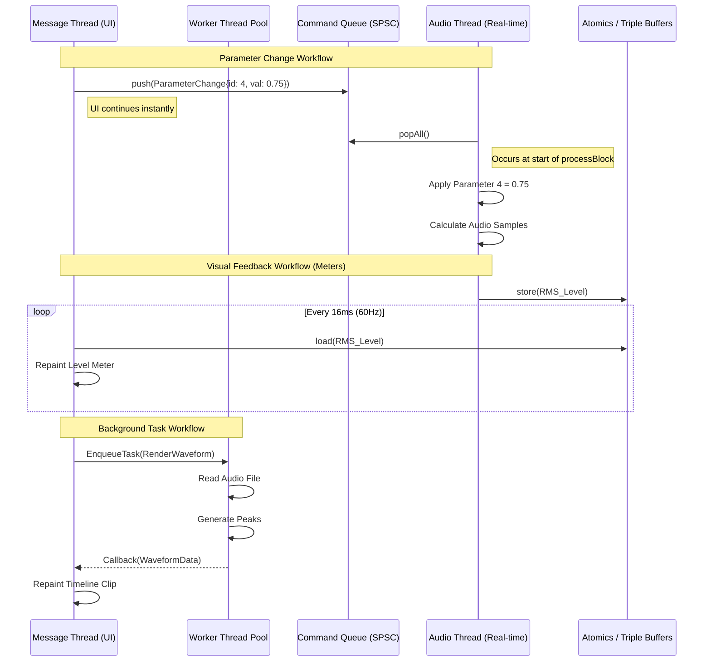

# Nimbus Threading Model

This document outlines the threading architecture for Nimbus. In a real-time audio application, thread management and communication are paramount. The model ensures that the real-time audio thread is never blocked, while the UI remains responsive and background tasks execute efficiently.

## 1. Thread Responsibilities

Nimbus utilizes three primary categories of threads, each with distinct responsibilities and strict constraints.

### 1.1 The Message Thread (Main UI Thread)
**Priority:** Normal
**Responsibilities:**
*   OS Event loop and Window management.
*   JUCE UI component rendering and layout.
*   Handling user input (mouse, keyboard).
*   Dispatching actions (Commands) to the ProjectSystem.
*   Reading state changes and updating the UI visually.
*   Spawning and managing worker threads.

**Constraints:**
*   Can block (e.g., waiting for dialogs), but should generally remain responsive.
*   **NEVER** directly calls into the Audio Thread's process block.
*   **NEVER** shares locked data structures with the Audio Thread.

### 1.2 The Audio Processing Thread
**Priority:** Real-time / Time-critical (OS dependent, e.g., `MMCSS` on Windows)
**Responsibilities:**
*   Executing the core `processBlock` function driven by the hardware audio interface.
*   Pulling data from the audio graph, tracks, and plugins.
*   Evaluating sample-accurate automation.
*   Popping events from the lock-free input queue (e.g., parameter changes from UI).
*   Pushing state data to the lock-free output queue (e.g., meter levels, playhead position).

**Constraints (The Golden Rule):**
*   **ZERO** memory allocations (`new`, `malloc`, string construction).
*   **ZERO** blocking locks (`std::mutex`, `std::unique_lock`, spinlocks if highly contended).
*   **ZERO** I/O operations (File reading/writing, networking).
*   **ZERO** system calls that might yield the thread.

### 1.3 Worker Threads (Thread Pool)
**Priority:** Below Normal / Normal
**Responsibilities:**
*   Disk I/O for waveform generation and audio file caching.
*   Background rendering (Freezing tracks, offline bounce).
*   Asynchronous file loading (e.g., streaming large sample libraries from disk).
*   Plugin scanning and indexing.
*   Autosaving the project state.

**Constraints:**
*   Managed by a centralized Thread Pool to avoid oversubscribing the CPU.
*   Communicates with the Message Thread via standard asynchronous callbacks or futures.

## 2. Lock-Free Messaging Strategy

To adhere to the constraints of the Audio Thread, all communication between the Message Thread (UI) and the Audio Thread must be lock-free.

### 2.1 Single-Producer, Single-Consumer (SPSC) Queues
For event-driven data, we use strictly lock-free, wait-free ring buffers (SPSC queues).
*   **Command Queue (UI -> Audio):** Used for parameter changes, transport commands (Play, Stop), and structural graph changes.
    *   *Producer:* Message Thread pushes a payload (e.g., `ParameterChangeMessage{paramId, newValue}`).
    *   *Consumer:* Audio Thread pops all available messages at the very beginning of its `processBlock`.
*   **Notification Queue (Audio -> UI):** Used to notify the UI of events that occurred on the audio thread (e.g., a buffer overrun, or a specific sample-accurate event).

### 2.2 Triple Buffering & Atomics
For continuous state updates where only the *latest* value matters, queues are inefficient. We use Atomics and Triple Buffering.
*   **Meters & Playhead (Audio -> UI):** The Audio Thread writes the current peak/RMS value or sample position to a lock-free triple buffer or `std::atomic<float>`. The UI thread reads this value at 60Hz via a timer.
*   **Simple Flags:** `std::atomic<bool>` is used for simple states like `isRecording`.

### 2.3 Deferred Garbage Collection
Since the Audio Thread cannot deallocate memory, deleting a plugin or track requires a specialized strategy.
1.  The UI instructs the Audio Thread to disconnect a node (via SPSC queue).
2.  The Audio Thread processes the disconnect and passes the now-orphaned pointer to a lock-free "Garbage Queue" (Audio -> UI).
3.  A timer on the Message Thread pops from the Garbage Queue and safely calls `delete`.

## 3. Thread Communication Diagram

