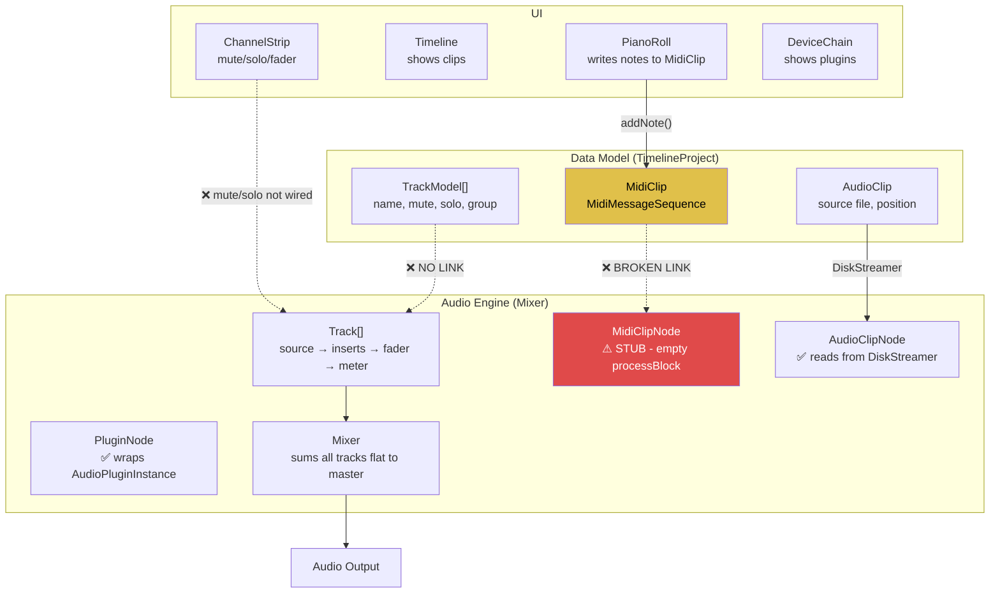

# Nimbus DAW — Full Codebase Audit

> [!CAUTION]
> This application has **fundamental architectural breaks** that make core DAW functionality non-operational. The UI renders but the underlying engine cannot produce MIDI audio, doesn't connect tracks to clips, and has no real group summing.

---

## Executive Summary

The app is a JUCE-based DAW skeleton with ~44 source files. The **audio clip playback pipeline works** for a hardcoded test file, and **plugin hosting works** (loading VSTs into insert chains). However:

- The **MIDI pipeline is completely broken** — notes written in the piano roll never reach audio output
- The **data model and audio engine are disconnected** — mute/solo/clips don't affect audio
- The **UI has significant layout bugs** — overlapping buttons, dead space, inconsistent icons
- **6 of 31 SVG icons are never used** despite being compiled into the binary
- **Group track summing is cosmetic only** — no audio routing exists for groups

---

## Architecture Diagram (Current State)



---

## 🔴 P0 — Broken Core Functionality

### 1. MidiClipNode::processBlock is a complete stub
**File:** [MidiClipNode.cpp](file:///C:/Users/Laptop/Documents/Projects/nimbus/Source/AudioEngine/MidiClipNode.cpp)

The entire MIDI playback engine is an empty comment:
```cpp
if (currentPos + numSamples > clipStart && currentPos < clipEnd) {
    // Read MIDI events from sequence and add to midiMessages buffer
}
```
**Impact:** MIDI tracks produce zero audio output. Notes added in the piano roll are stored in `MidiClip::sequence` but never read back.

### 2. DataModel ↔ AudioEngine tracks are completely disconnected
**File:** [NimbusEngine.cpp](file:///C:/Users/Laptop/Documents/Projects/nimbus/Source/Core/NimbusEngine.cpp)

`addTrack()` creates a `TrackModel` in `TimelineProject` AND a `Track` in `Mixer`, but there is **no link between them**. The audio engine Track has no source node, no clips, no connection to anything. There's no mechanism to:
- Set a Track's source node when clips are added
- Connect MidiClip/AudioClip to MidiClipNode/AudioClipNode
- Propagate mute/solo from TrackModel to audio Track
- Route MIDI tracks through instrument plugins

### 3. MidiBuffer never cleared between audio callbacks
**File:** [AudioDeviceManagerWrapper.cpp](file:///C:/Users/Laptop/Documents/Projects/nimbus/Source/AudioEngine/AudioDeviceManagerWrapper.cpp)

`dummyMidiBuffer` is never cleared. MIDI messages accumulate across callbacks → stuck notes.

### 4. Mixer passes shared MidiBuffer to all tracks
**File:** [Mixer.cpp](file:///C:/Users/Laptop/Documents/Projects/nimbus/Source/AudioEngine/Mixer.cpp)

One track's MIDI output contaminates the next track's input.

---

## 🟠 P1 — Non-functional UI Features

### 5. Track mute/solo has no audio engine backing
**File:** [Track.h](file:///C:/Users/Laptop/Documents/Projects/nimbus/Source/AudioEngine/Track.h)

The `Track` class has **no mute or solo member variables or logic**. The UI toggles are cosmetic.

### 6. Group summing is cosmetic only
`TimelineProject::groupTracks()` sets `parentGroupId` on children, but the `Mixer` sums all tracks flat to master. No group buses exist.

### 7. No instrument plugin slot
MIDI tracks need a synth as their source, but Track only has a generic `sourceNode` with no concept of instrument vs effect.

---

## 🟡 P2 — UI Layout & Icon Issues

### 8. Toolbar button overlap
**File:** [TopToolbarComponent.cpp](file:///C:/Users/Laptop/Documents/Projects/nimbus/Source/UI/MainLayout/TopToolbarComponent.cpp#L219-L220)

`browserToggleButton` and `detailToggleButton` use `getLocalBounds()` instead of the consumed `bounds` variable, causing them to overlap other buttons at absolute positions.

### 9. Icon size cap too small
**File:** [NimbusLookAndFeel.cpp](file:///C:/Users/Laptop/Documents/Projects/nimbus/Source/UI/DesignSystem/NimbusLookAndFeel.cpp#L109)

All icons capped at 18px max regardless of button size. A 40px-wide button still gets a tiny 18px icon.

### 10. Six SVG icons compiled but never used

| Icon | Status |
|------|--------|
| `pause.svg` | Play button never toggles to pause |
| `alert-outline.svg` | Defined but never referenced |
| `settings.svg` | Defined but never referenced |
| `plugin-add.svg` | No "add plugin" button exists |
| `music-accidental-sharp.svg` | Defined but never referenced |
| `tune-vertical.svg` | Defined as `Routing` but never used |

### 11. GroupTrackHeader uses text instead of SVG icons
**File:** [GroupTrackHeaderComponent.cpp](file:///C:/Users/Laptop/Documents/Projects/nimbus/Source/UI/Timeline/GroupTrackHeaderComponent.cpp#L146)

Uses raw text `">"`, `"v"`, `"M"`, `"S"` instead of the SVG icons that `TrackHeaderComponent` and `ChannelStripComponent` use. Visually inconsistent.

### 12. Channel strip has 45px dead space
**File:** [ChannelStripComponent.cpp](file:///C:/Users/Laptop/Documents/Projects/nimbus/Source/UI/MainLayout/ChannelStripComponent.cpp#L182)

Reserves 65px at top for name + dropdowns, but only the 20px name label goes there. The input/routing combos are placed at the bottom. 45px of empty space.

### 13. DeviceChain and SideBrowser create SVG Drawables every paint() call
No caching — allocates and parses SVGs on every frame repaint. Performance issue.

### 14. No vertical scrolling in timeline
Tracks that overflow the viewport height are unreachable. No scrollbar.

### 15. No horizontal scrolling in mixer
Channel strips overflow past the master strip with many tracks.

### 16. Track header VU meters always empty
**File:** [TrackHeaderComponent.cpp](file:///C:/Users/Laptop/Documents/Projects/nimbus/Source/UI/Timeline/TrackHeaderComponent.cpp#L184)

`float level = 0.0f` is hardcoded. No connection to the audio engine's `LevelMeter`.

### 17. Timeline headers on RIGHT side
**File:** [TimelineComponent.cpp](file:///C:/Users/Laptop/Documents/Projects/nimbus/Source/UI/Timeline/TimelineComponent.cpp#L232)

Headers are placed right of lanes — opposite of every major DAW.

---

## 🔵 P3 — Stubs & Missing Features

| Component | Status |
|-----------|--------|
| AudioClipViewComponent | 2-line stub — "WIP" text only |
| NotesPanelComponent | 4 buttons, all no-op |
| PianoRoll mouseDrag | Empty — no note dragging |
| ClipPropertiesComponent (audio mode) | Sliders have no ranges/callbacks |
| TrackLaneComponent context menu | 25 of 27 items unimplemented |
| Audio recording | Transport has record state but nothing reads input |
| MIDI input routing | No live MIDI handling |
| Undo/Redo | No history system |
| Plugin delay compensation | Latency reported but never compensated |
| Send/Return buses | Not implemented |
| Clip drag/move/resize | No interaction on clips in arrangement |

---

## 🔧 CMakeLists.txt Issues

1. **`Source/UI/PluginWindow.cpp` listed TWICE** (lines 120 and 138) — potential linker error
2. Several header files missing from `target_sources` (won't appear in IDE solution explorer)

---

## File Inventory

| Directory | Files | Lines | Status |
|-----------|-------|-------|--------|
| Core/ | 2 | 135 | Service container, works but limited |
| AudioEngine/ | 16 | 946 | Playback works for audio; MIDI stubbed |
| DataModel/ | 4 | 160 | Models exist, disconnected from engine |
| PluginHost/ | 2 | 163 | Scanning + loading works |
| DSP/ | 3 | 191 | Gain/Pan/Meter work |
| UI/DesignSystem/ | 5 | 356 | Design tokens + LookAndFeel |
| UI/MainLayout/ | 12 | 1,443 | Layout bugs throughout |
| UI/DetailView/ | 10 | 637 | Piano roll works; rest stubbed |
| UI/Timeline/ | 8 | 1,264 | Arrangement view, layout issues |
| UI/Mixer/ | 2 | 59 | Group indicator only |
| UI/ (root) | 4 | 513 | MainWindow + PluginWindow |
| **Total** | **~68** | **~5,867** | |
