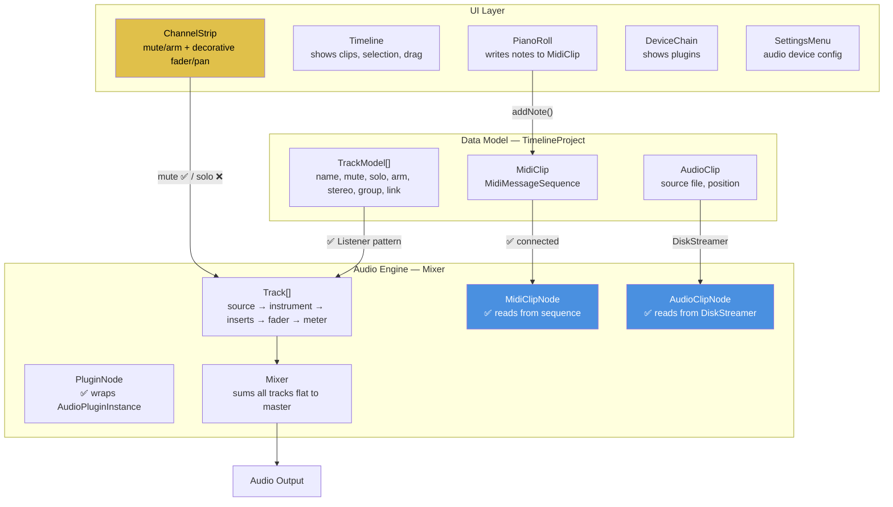

# Nimbus DAW — Full Codebase Audit v2
**Date:** 2026-06-25  
**Previous audit:** [v1_status_2026-06-18.md](file:///C:/Users/Laptop/Documents/Projects/nimbus/docs/v1_status_2026-06-18.md)  
**Codebase:** 83 source files, ~6,457 lines | 40 SVG assets | 4 test cases

> [!IMPORTANT]
> Since the v1 audit on June 18, significant progress has been made: **MIDI playback now works**, the **data model and audio engine are connected** via listener callbacks, and the **UI has been substantially improved** with new icons, a settings menu, clip interaction, and mono/stereo switching. However, **critical threading bugs** in the audio engine remain, the **fader and pan controls are still decorative**, and **solo is not wired to the engine**.

---

## v1 → v2 Issue Resolution Tracker

| v1 Issue | Sev | Status | Notes |
|----------|-----|--------|-------|
| P0-1: MidiClipNode::processBlock is a stub | 🔴 | ✅ **Fixed** | Full implementation reads events from MidiClip sequence. Has new bugs (see §1.3). |
| P0-2: DataModel ↔ AudioEngine disconnected | 🔴 | ⚠️ **Partial** | `NimbusEngine` now implements `TimelineProject::Listener` with `trackMuteChanged`, `trackArmChanged`, `trackClipsChanged`, `trackRemoved`. **Solo still missing.** Audio clip source node creation is still stubbed. |
| P0-3: MidiBuffer never cleared | 🔴 | ✅ **Fixed** | `dummyMidiBuffer.clear()` added. |
| P0-4: Mixer passes shared MidiBuffer to all tracks | 🔴 | ❌ **Still broken** | One track's MIDI output still contaminates the next. |
| P1-5: Track has no mute/solo | 🟠 | ⚠️ **Partial** | Mute and arm are wired. **Solo button has no handler** — clicking it does nothing. |
| P1-6: Group summing is cosmetic | 🟠 | ❌ **Still broken** | No group bus routing in Mixer. |
| P1-7: No instrument plugin slot | 🟠 | ✅ **Fixed** | Track now has `instrument` slot with `setInstrumentPlugin()`. |
| P2-8: Toolbar button overlap | 🟡 | ✅ **Fixed** | Buttons now use consumed `bounds` variable. |
| P2-9: Icon size cap too small | 🟡 | ✅ **Fixed** | Icon sizing improved in NimbusLookAndFeel. |
| P2-10: 6 unused SVGs | 🟡 | ⚠️ **Partial** | `settings.svg` now used (settings menu). Others still unused. Now **11 SVGs** unused (6 `volume-*.svg` not even compiled). |
| P2-11: GroupTrackHeader uses text not SVGs | 🟡 | ⚠️ **Partial** | Fold icons updated, but mute/solo still use raw text. |
| P2-12: ChannelStrip 45px dead space | 🟡 | ✅ **Fixed** | Layout reworked. |
| P2-13: SVG Drawables created every paint() | 🟡 | ✅ **Fixed** | Icons cached in constructors. |
| P2-14: No vertical scrolling in timeline | 🟡 | ✅ **Fixed** | Viewport added. |
| P2-15: No horizontal scrolling in mixer | 🟡 | ✅ **Fixed** | Viewport added for channel strips. |
| P2-16: Track header VU meters always empty | 🟡 | ✅ **Fixed** | Connected to engine's `LevelMeter`. |
| P2-17: Timeline headers on RIGHT side | 🟡 | ✅ **Fixed** | Headers now on left. |
| CMake: PluginWindow.cpp listed twice | 🔧 | ✅ **Fixed** | Now appears once. |

**Score: 11/17 fully fixed, 4 partially fixed, 2 still broken.**

---

## Architecture Diagram (Current State)

---

## 🔴 P0 — Critical Bugs (data corruption / crashes / audio glitches)

### 1.1 Data race on `Track::source` and `Track::instrument`
**Files:** [Track.cpp:82-86](file:///C:/Users/Laptop/Documents/Projects/nimbus/Source/AudioEngine/Track.cpp#L82-L86), [NimbusEngine.cpp:82-104](file:///C:/Users/Laptop/Documents/Projects/nimbus/Source/Core/NimbusEngine.cpp#L82-L104)

`setSourceNode()` and `setInstrumentPlugin()` are called from the UI thread (via `trackClipsChanged` listener), while `processBlock` reads these pointers on the audio thread. The old node is destroyed on the UI thread while the audio thread may still be calling `processBlock` on it. **Undefined behavior.**

> [!CAUTION]
> This can crash the app when adding/changing clips or instruments on a track during playback.

**Fix:** Use a lock-free swap queue (push new node via a queue, swap on the audio thread in processBlock, defer destruction of old node to the message thread).

---

### 1.2 Data race on `Mixer::tracks` vector
**Files:** [Mixer.h:46-53](file:///C:/Users/Laptop/Documents/Projects/nimbus/Source/AudioEngine/Mixer.h#L46-L53), [Mixer.cpp:28-41](file:///C:/Users/Laptop/Documents/Projects/nimbus/Source/AudioEngine/Mixer.cpp#L28-L41)

`getTrack(index)` and `getTrackPeakLevel(index)` are called from the UI thread for metering and track access, while `processBlock` mutates the `tracks` vector on the audio thread (via `push_back` from the add queue and `erase` from the remove queue). A `push_back` can reallocate the vector, invalidating all pointers while the UI thread reads.

**Fix:** Use a separate read-only snapshot for the UI, or protect access with a SpinLock.

---

### 1.3 Stuck MIDI notes — noteOff events lost across block boundaries
**File:** [MidiClipNode.cpp:37-56](file:///C:/Users/Laptop/Documents/Projects/nimbus/Source/AudioEngine/MidiClipNode.cpp#L37-L56)

Only `noteOn` events are iterated. NoteOff is only emitted if `event->noteOffObject != nullptr` AND it falls within the current block. If a noteOff falls in a **future block**, it is never emitted because the loop skips non-noteOn events. All CC, pitch bend, aftertouch, and program changes are also silently dropped. Additionally, no "all notes off" is sent when transport stops.

---

### 1.4 Data race on `MidiClip::sequence`
**Files:** [MidiClipNode.cpp:29](file:///C:/Users/Laptop/Documents/Projects/nimbus/Source/AudioEngine/MidiClipNode.cpp#L29), [MidiClip.cpp:16-18](file:///C:/Users/Laptop/Documents/Projects/nimbus/Source/DataModel/MidiClip.cpp#L16-L18)

The audio thread reads `midiClip->getSequence()` while the UI thread writes to it (via `addNote()` in the piano roll). `MidiMessageSequence` is not thread-safe.

---

### 1.5 Mixer still passes shared MidiBuffer to all tracks
**File:** [Mixer.cpp:52](file:///C:/Users/Laptop/Documents/Projects/nimbus/Source/AudioEngine/Mixer.cpp#L52)

Unchanged since v1. One track's MIDI output contaminates the next track's input.

---

### 1.6 Batch track removal index corruption
**File:** [Mixer.cpp:36-41](file:///C:/Users/Laptop/Documents/Projects/nimbus/Source/AudioEngine/Mixer.cpp#L36-L41)

If multiple remove indices are queued (e.g. `[2, 3]`), removing index 2 shifts index 3 → 2, but the next removal still targets the original index 3, now pointing at the wrong track or out-of-bounds.

---

## 🟠 P1 — Broken Features

### 2.1 Solo button is completely disconnected
**Files:** [TrackHeaderComponent.cpp:46](file:///C:/Users/Laptop/Documents/Projects/nimbus/Source/UI/Timeline/TrackHeaderComponent.cpp#L46), [ChannelStripComponent.cpp:64](file:///C:/Users/Laptop/Documents/Projects/nimbus/Source/UI/MainLayout/ChannelStripComponent.cpp#L64)

Both `soloButton` instances have `setClickingTogglesState(true)` but **no `onClick` handler**. `TimelineProject::Listener` has no `trackSoloChanged` callback. `NimbusEngine` has no solo handler. The Mixer checks `isSoloed()` on each track, but `setSoloed()` is never called by anything. Solo is entirely cosmetic.

### 2.2 Solo does not override mute
**Files:** [Track.cpp:28](file:///C:/Users/Laptop/Documents/Projects/nimbus/Source/AudioEngine/Track.cpp#L28), [Mixer.cpp:51](file:///C:/Users/Laptop/Documents/Projects/nimbus/Source/AudioEngine/Mixer.cpp#L51)

If a track is both muted and soloed, the Mixer calls its `processBlock` (because it's soloed), but `processBlock` returns early (because `muted_` is true). In every major DAW, solo overrides mute.

### 2.3 Fader and pan are purely decorative
**File:** [ChannelStripComponent.cpp:39-52](file:///C:/Users/Laptop/Documents/Projects/nimbus/Source/UI/MainLayout/ChannelStripComponent.cpp#L39-L52)

The fader slider and pan knob have **no `onValueChange` callback**. Moving them has zero effect on actual audio volume or panning. There is no `TrackModel::volume` or `TrackModel::pan` in the data model either.

### 2.4 `atomic<double>::fetch_add` may lock on the audio thread
**File:** [Transport.cpp:55](file:///C:/Users/Laptop/Documents/Projects/nimbus/Source/AudioEngine/Transport.cpp#L55)

`std::atomic<double>::is_always_lock_free` is `false` on MSVC/x86-64. The `advancePosition` call in every audio callback could take a mutex. Should use `std::atomic<int64_t>` for a sample counter instead.

### 2.5 AudioGraph destroys nodes on the audio thread
**File:** [AudioGraph.cpp:44](file:///C:/Users/Laptop/Documents/Projects/nimbus/Source/AudioEngine/AudioGraph.cpp#L44)

`erase()` calls the `unique_ptr` destructor, which can involve heap deallocation, file I/O (plugin state save), or system calls. This violates real-time constraints and can cause audio glitches.

### 2.6 DiskStreamer position desync on underrun
**File:** [DiskStreamer.cpp:61-68](file:///C:/Users/Laptop/Documents/Projects/nimbus/Source/AudioEngine/DiskStreaming/DiskStreamer.cpp#L61-L68)

On ring buffer underrun, `readPosition` advances by `numSamples` regardless of how many samples were actually read, causing permanent desynchronization.

### 2.7 Disarm + instrument clears entire trackBuffer
**File:** [Track.cpp:51-55](file:///C:/Users/Laptop/Documents/Projects/nimbus/Source/AudioEngine/Track.cpp#L51-L55)

The "mute instrument when disarmed and stopped" logic clears the entire `trackBuffer`, which also wipes any audio from the source node (audio clip playback). A non-armed track with both a source clip and an instrument loses all audio.

---

## 🟡 P2 — UI & Performance Issues

### 3.1 60fps unconditional full repaint of entire timeline
**File:** [TimelineComponent.cpp:336](file:///C:/Users/Laptop/Documents/Projects/nimbus/Source/UI/Timeline/TimelineComponent.cpp#L336)

`repaint()` is called every timer tick (60Hz) **unconditionally** — even when the transport is stopped and nothing has changed. This repaints the entire timeline including all track lanes, headers, clips, and the grid.

### 3.2 Per-track 30fps timer overhead (×2 per track)
**Files:** [TrackHeaderComponent.cpp:100](file:///C:/Users/Laptop/Documents/Projects/nimbus/Source/UI/Timeline/TrackHeaderComponent.cpp#L100), [ChannelStripComponent.cpp:97](file:///C:/Users/Laptop/Documents/Projects/nimbus/Source/UI/MainLayout/ChannelStripComponent.cpp#L97)

Each track header AND each channel strip runs its own 30fps timer for VU meter updates. With 50 tracks, that's **3,000 timer callbacks/second**. Should use a single parent timer.

### 3.3 O(N) MIDI event scan per processBlock
**File:** [MidiClipNode.cpp:31](file:///C:/Users/Laptop/Documents/Projects/nimbus/Source/AudioEngine/MidiClipNode.cpp#L31)

Iterates **every event** in the entire MIDI sequence every audio callback. For clips with thousands of events, this is an O(N) scan on the audio thread. Should maintain a cursor.

### 3.4 Zoom doesn't update clip positions
**File:** [TimelineComponent.cpp:344](file:///C:/Users/Laptop/Documents/Projects/nimbus/Source/UI/Timeline/TimelineComponent.cpp#L344)

After zooming, only `repaint()` is called — but `resized()` is not called, so clip component bounds remain at their old pixel positions. Clips appear misplaced until the next scroll or resize.

### 3.5 Horizontal scroll wheel is broken
**File:** [TimelineComponent.cpp:345-346](file:///C:/Users/Laptop/Documents/Projects/nimbus/Source/UI/Timeline/TimelineComponent.cpp#L345-L346)

The `else` branch for non-Ctrl mousewheel is empty. Horizontal scrolling via mouse wheel does nothing.

### 3.6 Fold icon logic inverted
**File:** [TrackHeaderComponent.cpp:98](file:///C:/Users/Laptop/Documents/Projects/nimbus/Source/UI/Timeline/TrackHeaderComponent.cpp#L98)

When folded, it shows the "Fold" icon; when unfolded, it shows "Unfold." Backwards — a folded track should show the unfold action icon.

### 3.7 BottomMixerComponent doesn't respond to fold state changes
**File:** [BottomMixerComponent.cpp](file:///C:/Users/Laptop/Documents/Projects/nimbus/Source/UI/MainLayout/BottomMixerComponent.cpp)

Missing `trackFoldStateChanged` listener implementation. When a group is folded/unfolded, the mixer view doesn't update until the next layout trigger.

### 3.8 Stereo VU meters show identical levels on both channels
**File:** [ChannelStripComponent.cpp:160-161](file:///C:/Users/Laptop/Documents/Projects/nimbus/Source/UI/MainLayout/ChannelStripComponent.cpp#L160-L161)

Both L and R channels call `drawMeter(g, ..., currentLevel)` with the same `currentLevel` value. There is no separate left/right peak data.

### 3.9 ChannelStrip repaint() repaints entire strip on meter update
**File:** [ChannelStripComponent.cpp:125](file:///C:/Users/Laptop/Documents/Projects/nimbus/Source/UI/MainLayout/ChannelStripComponent.cpp#L125)

Every meter tick calls `repaint()` on the entire component instead of just the meter area. This causes unnecessary redraws of labels, buttons, faders, and knobs 30×/sec.

### 3.10 15+ instances of hardcoded fonts bypass Typography system
**Files:** TrackHeaderComponent (L63-64), BottomMixerComponent (L9), ClipPropertiesComponent (L9), ChannelStripComponent (L34), SideBrowserComponent (L54), and others use raw `juce::Font(N)` instead of the design system typography.

### 3.11 Hardcoded colors bypass Colors.h
**Files:** ClipComponent (L39 — yellow for MIDI notes), TrackHeaderComponent (L221-228 — VU gradient), ChannelStripComponent (L171-173 — meter gradient), PianoRollContent (L78 — piano keys). Should all use design system color tokens.

### 3.12 Typography::getMonospacedFont returns proportional font
**File:** [Typography.h:53-54](file:///C:/Users/Laptop/Documents/Projects/nimbus/Source/UI/DesignSystem/Typography.h#L53-L54)

Named "monospaced" but returns Inter Regular (a proportional font). Misleading and causes alignment issues in time displays.

### 3.13 `unlinkTrack` sets random UUID instead of null
**File:** [TimelineProject.cpp:170](file:///C:/Users/Laptop/Documents/Projects/nimbus/Source/DataModel/TimelineProject.cpp#L170)

Unlinked tracks get a random `juce::Uuid()` instead of `juce::Uuid::null()`, leaving dangling references.

---

## 🔵 P3 — Stubs, Missing Features & Dead Code

| Component | Status |
|-----------|--------|
| Audio clip source node creation | Stubbed — "Not implemented, requires DiskStreamer" |
| Audio recording (input) | `inputChannelData` ignored in AudioDeviceManagerWrapper |
| Send/Return buses | Not implemented |
| Group bus routing | Not implemented — flat sum only |
| Plugin Delay Compensation | Latency calculated, never applied |
| Plugin sandboxing | Not implemented |
| Loop/cycle playback | Transport has no loop support |
| Tempo changes | `tempo` hardcoded at 120 BPM, no setter |
| Undo/Redo | No history system |
| Project save/load | Not implemented |
| Offline export/bounce | Not implemented |
| MIDI device selection | No device picker |
| TrackLaneComponent context menu | 25 of 27 items are no-ops |
| ClipComponent context menu | Cut/Copy/Delete are no-ops |
| Track rename | Context menu handler is empty |
| Plugin parameter mapping | Not implemented |
| Automation envelopes | Stub directory, empty |

### Empty Scaffold Directories (0 files each)
`Source/Automation`, `Source/FileManagement`, `Source/MidiEngine`, `Source/Mixer`, `Source/ProjectSystem`, `Source/Recording`, `Source/Rendering`, `Source/Timeline`, `Source/Utilities`

---

## 🔧 Build & Infrastructure Issues

| Issue | Severity | Details |
|-------|----------|---------|
| **6 SVGs not compiled into binary** | 🟡 | `volume-equal/high/low/medium/minus/plus.svg` exist on disk but are NOT in CMakeLists.txt |
| **~30 headers missing from `target_sources`** | 🟡 | All `.h` files in AudioEngine/, DSP/, DataModel/, Core/, Concurrency/ are not listed — invisible in IDE |
| **Test CMake: duplicate `main()`** | 🟡 | Links `Catch2::Catch2WithMain` but also compiles own `Main.cpp` with `Catch::Session().run()` |
| **Tests compile production sources directly** | 🟡 | Fragile — should link a library target instead |
| **Hardcoded sample rate in PluginManager** | 🟡 | Creates plugin instances at 44100/512 regardless of device settings |
| **`JUCE_PLUGINHOST_AU=1` on Windows** | ⚪ | AU is macOS-only, harmless but misleading |
| **`Assets/Fonts/dummy.txt` on disk** | ⚪ | Accidental placeholder file |

---

## Test Coverage

| Area | Test Cases | Assertions | Status |
|------|-----------|------------|--------|
| AudioGraph | 1 | ~10 | ✅ |
| Mixer | 1 | ~10 | ✅ |
| AudioRingBuffer | 1 | ~20 | ✅ |
| LockFreeQueue | 1 (2 sections) | ~2,631 | ✅ |
| **Everything else** | **0** | **0** | ❌ |

**Critical gaps:** Transport, MidiClipNode, Track mute/solo/arm, TimelineProject, GainNode, DiskStreamer, PluginManager, all UI components.

---

## File Inventory (v2)

| Directory | Files | Lines (est.) | Δ from v1 | Status |
|-----------|-------|-------------|-----------|--------|
| Core/ | 2 | ~175 | +40 | Listener integration added |
| AudioEngine/ | 21 | ~1,050 | +104 | MidiClipNode, Track, Mixer expanded |
| DataModel/ | 6 | ~220 | +60 | Stereo, link, arm support |
| PluginHost/ | 2 | ~163 | — | No change |
| DSP/ | 3 | ~191 | — | No change |
| Concurrency/ | 1 | ~99 | — | No change |
| UI/DesignSystem/ | 5 | ~390 | +34 | New icons, look-and-feel updates |
| UI/MainLayout/ | 12 | ~1,670 | +227 | Channel strip rework, settings menu |
| UI/DetailView/ | 10 | ~770 | +133 | Piano roll, notes panel expanded |
| UI/Timeline/ | 10 | ~1,510 | +246 | Clip interaction, track link |
| UI/Settings/ | 2 | ~65 | +65 | **New** — settings menu |
| UI/ (root) | 4 | ~520 | +7 | Minor MainWindow updates |
| UI/Mixer/ | 2 | ~59 | — | No change |
| Tests/ | 5 | ~188 | — | No change |
| **Total** | **~85** | **~7,080** | **+916** | |

---

## Roadmap Progress Summary

| Phase | Progress | Key Gaps |
|-------|----------|----------|
| **Phase 1: MVP Scaffolding** | ✅ ~95% | Test CMake has minor issues |
| **Phase 2: Mixer & DSP** | ⚠️ ~40% | No group buses, no PDC, fader/pan disconnected, no EQ |
| **Phase 3: Timeline & Waveform** | ✅ ~80% | Audio clip source wiring stubbed, no waveform worker threads |
| **Phase 4: Plugin Hosting** | ⚠️ ~50% | No sandboxing, no parameter mapping, no SQLite DB |
| **Phase 5: MIDI & Piano Roll** | ⚠️ ~60% | Stuck notes, no device selection, no MPE |
| **Phase 6: Recording & Automation** | ❌ 0% | Entirely unstarted |
